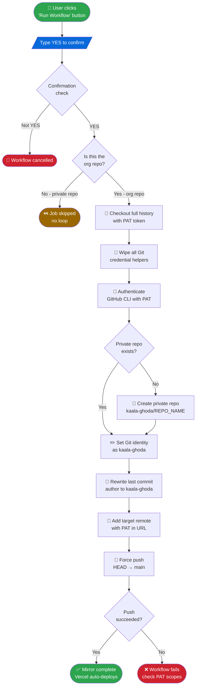

# Mirror Workflow — Visual Flow

> This diagram shows the complete flow of the Manual Mirror to Private Repo workflow.

```mermaid
flowchart TD
    A([👤 User clicks\n'Run Workflow' button]) --> B[/Type YES to confirm/]
    B --> C{Confirmation\ncheck}
    C -->|Not YES| Z([🚫 Workflow cancelled])
    C -->|YES| D{Is this the\norg repo?}
    D -->|No - private repo| Y([⏭️ Job skipped\nno loop])
    D -->|Yes - org repo| E[🔄 Checkout full history\nwith PAT token]

    E --> F[🧹 Wipe all Git\ncredential helpers]
    F --> G[🔑 Authenticate\nGitHub CLI with PAT]
    G --> H{Private repo\nexists?}
    H -->|No| I[📁 Create private repo\nkaala-ghoda/REPO_NAME]
    H -->|Yes| J[✏️ Set Git identity\nas kaala-ghoda]
    I --> J
    J --> K[📝 Rewrite last commit\nauthor to kaala-ghoda]
    K --> L[🔗 Add target remote\nwith PAT in URL]
    L --> M[🚀 Force push\nHEAD → main]
    M --> N{Push\nsucceeded?}
    N -->|Yes| O([✅ Mirror complete\nVercel auto-deploys])
    N -->|No| P([❌ Workflow fails\ncheck PAT scopes])

    style A fill:#2da44e,color:#fff
    style O fill:#2da44e,color:#fff
    style Z fill:#cf222e,color:#fff
    style P fill:#cf222e,color:#fff
    style Y fill:#9a6700,color:#fff
    style B fill:#0969da,color:#fff
```